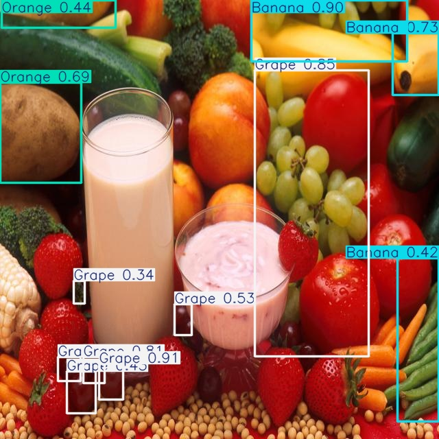
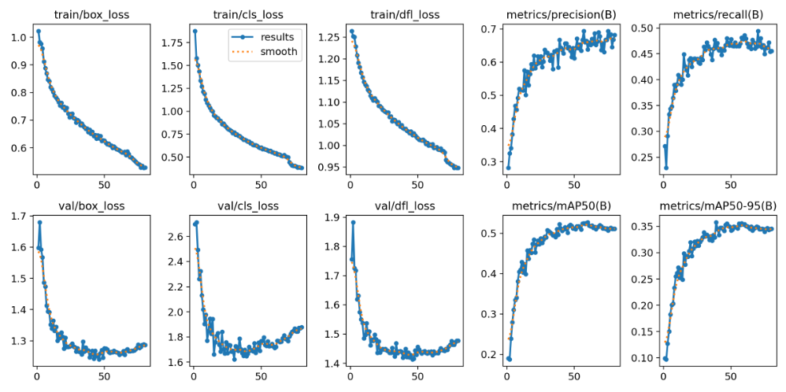
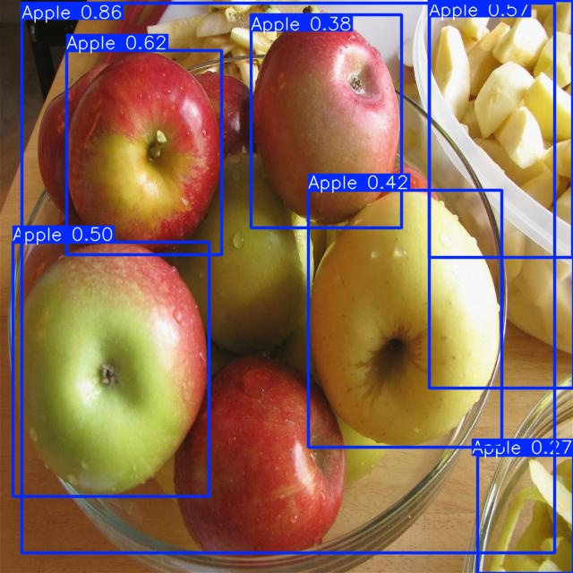
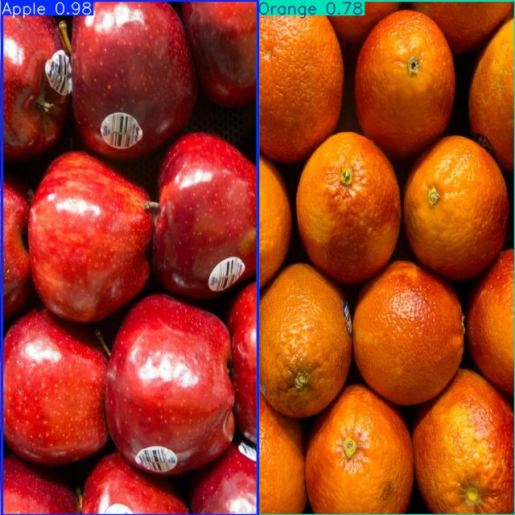

# 🍊 Fruit-image Detection 🍎

## Overview  
This project demonstrates an end-to-end Object Detection pipeline using YOLOv8 on a custom dataset of fruits.
The goal is to detect and classify multiple fruit types in images with high accuracy.

<p align="center">
  
</p>


### 🔑 Key points:
- **Model Training & Fine-tuning**: Trained baseline model (YOLOv8n) and fine-tuned with (YOLOv8s) for improved accuracy.
- **Transfer Learning**: Leveraged pretrained YOLOv8 weights and applied custom fine-tuning on 7k+ annotated images across 6 classes.
- **Data Augmentation**: Applied transformations (scaling, rotation, color jitter, mosaic) to improve generalization and reduce overfitting.
- **Experiment Tracking & Evaluation**: Compared baseline and fine-tuned models using Precision, Recall, mAP@50, mAP@50-95.
- **Reproducibility**: Training pipelines implemented in Jupyter Notebook and can run both on local CPU (demo mode) and GPU (Kaggle).

## Project Structure
```
📂 Project Root
├── 📂 Data
│   ├── 📂 test
│   │   ├── 📂 images
│   │   │   ├── x.jpg
│   │   │   └── ....
│   │   └── 📂 labels
│   │       ├── x.txt
│   │       └── ....
│   ├── 📂 train
│   │   ├── 📂 images
│   │   │   ├── y.jpg
│   │   │   └── ....
│   │   └── 📂 labels
│   │       ├── y.txt
│   │       └── ....
│   ├── 📂 valid
│   │   ├── 📂 images
│   │   │   ├── z.jpg
│   │   │   └── ....
│   │   └── 📂 labels
│   │       ├── z.txt
│   │       └── ....
│   └── data.yaml
├── 📂 baseline_model
│   └── best.pt
├── 📂 fine_tune_model
│   └── best.pt
├── fruit_detection.ipynb
├── 📂 runs
├── 📂 result_img
├── requirements.txt
└── README.md
```
## Dataset
### The dataset used in this project is publicly available on Kaggle
**Download Instructions**
1. Go to the Kaggle dataset page: [Fruit Detection Dataset (Kaggle)](https://www.kaggle.com/datasets/lakshaytyagi01/fruit-detection).
2. Download the dataset ZIP file.
3. Extract the contents into the Data/ folder of this repository.

*Notes:*
- `data.yaml` contains the dataset configuration (classes, paths, etc.).
- You may need to update `data.yaml` if your dataset is stored in a different location.
- For training, YOLOv8 will automatically read the images and labels from these folders.

## Approach / Strategy
To tackle the Object Detection problem on a dataset of ~7,000 images with 6 classes, I designed a two-stage training pipeline:

**1. Baseline**
- Started with YOLOv8n (nano) as a lightweight baseline.
- Training configuration:
  - `epochs = 50`
  - `imgsz = 640`
  - `batch = 16`
- Results:
  - `mAP50: 0.495`
  - `mAP50-95: 0.333`
  - `Precision: 0.663`
  - `Recall: 0.432`
 
**2. Fine-tuning with YOLOv8s**
- To improve performance, I applied several fine-tuning strategies:
  - Model: `YOLOv8s` (small) – stronger than `YOLOv8n`.
  - Epochs: increased to `80` for longer training.
  - Optimizer: used `AdamW` with a smaller learning rate (`lr0 = 0.001`).
  - Image size: increased to `800` to better detect small objects.
  - Data Augmentation: `weight_decay = 0.0005`.
- Training configuration:
  - `epochs = 80`
  - `imgsz = 640`
  - `batch = 16`
- Results:
  - `mAP50: 0.523`
  - `mAP50-95: 0.358`
  - `Precision: 0.665`
  - `Recall: 0.462`
 
👉 Compared to the baseline, the fine-tuned model improved mAP50 by ~14%, improved mAP50-95 by ~7% and achieved more reliable object detection.

## Result
### Training Curve
<p align="center">
  
</p>

### Sample Predictions
Below are examples of model predictions on test images:

<p align="center">
  
  
</p>


